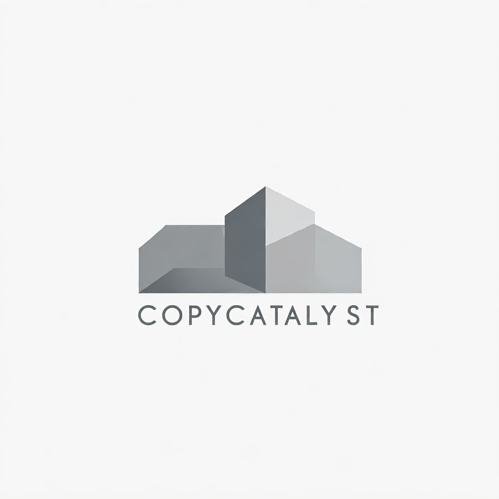

**CopyCatalyst** is a powerful tool designed to make copying code and files easier for interacting with Large Language Models (LLMs). It lets you quickly select multiple files and automatically format their contents with filenames, all copied to your clipboard.

## Installation

```
git clone https://github.com/0xrushi/copycatalyst.git
cd copycatalyst
pip install -e .
```


### Usage

**To run copycatalyst in current dir**
```
copy catalyst .
```

**To select all files in current dir**
```
copycatalyst -A .
```

**Navigation:**

* Use the arrow keys (`↑`, `↓`, `←`, `→`) to navigate the file list.
* Press `Space` to add file to selection.
* Press `Ctrl+F` to search for a file by name.
* Press `Enter` to:
  * Search for a specific file (when in search mode).
  * Submit the selected files and copy the formatted content to the clipboard.
* Press `Ctrl+C` to exit CopyCatalyst.
